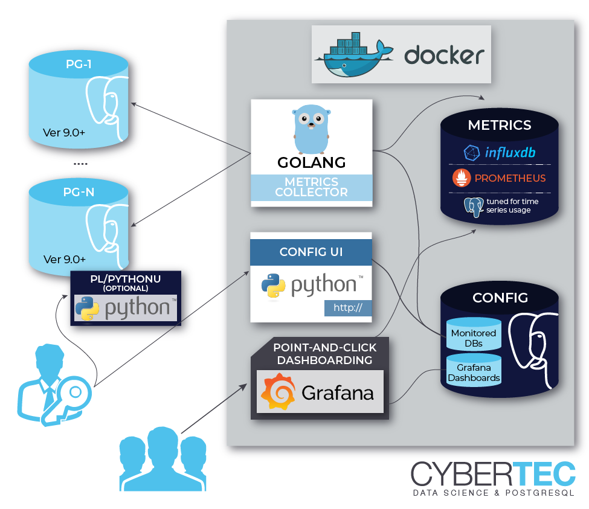

The main development idea around pgwatch was to do the minimal work
needed and not to reinvent the wheel - meaning that pgwatch is mostly
just about gluing together already some proven pieces of software for
metrics storage and using Grafana for dashboarding. So here a listing of
components that can be used to build up a monitoring setup around the
pgwatch metrics collector. Note that most components are not mandatory
and for tasks like metrics storage there are many components to choose
from.

## The metrics gathering daemon

The metrics collector, written in Go, is the only mandatory and most
critical component of the whole solution. The main task of the pgwatch
collector / daemon is pretty simple - reading the configuration and
metric defintions, fetching the metrics from the configured databases
using the configured connection info and finally storing the metrics to
some other database, or just exposing them over a port for scraping in
case of Prometheus mode.

## Configuration

The configuration says which databases, how often and with which metrics
(SQL-s queries) are to be gathered. There are 3 options to store the
configuration:

- A PostgreSQL database holding a simple schema with 5 tables;
- File based approach - YAML config file.

## Measurements storage

Many options here so that one can for example go for maximum storage
effectiveness or pick something where they already know the query
language:

### [PostgreSQL](https://www.postgresql.org/) 
PostgreSQL is a world's most advanced Open Source RDBMS.

Postgres storage is based on the JSONB datatype so minimally
version 9.4+ is required, but for bigger setups where partitioning
is a must, v11+ is needed. Any already existing Postgres database
will do the trick, see the [Bootstrapping the Metrics DB](../howto/metrics_db_bootstrap.md) section for details.

### [TimescaleDB](https://www.timescale.com/) 
TimescaleDB is a time-series extension for PostgreSQL.

Although technically a plain extension it's often mentioned as a
separate database system as it brings custom data compression to
the table, enabling huge disk savings over standard Postgres. Note
that pgwatch does not use Timescale's built-in *retention*
management but a custom version.

### [Prometheus](https://prometheus.io/) 
Prometheus is a time series database and monitoring system.

Though Prometheus is not a traditional database system, it's a
good choice for monitoring Cloud-like environments as the
monitoring targets don't need to know too much about how actual
monitoring will be carried out later and also Prometheus has a
nice fault-tolerant alerting system for enterprise needs. By
default Prometheus is not set up for long term metrics storage!

### JSON files
Plain text files for testing / special use cases.

## The Web UI

The second homebrewn component of the pgwatch solution is an optional
and relatively simple Web UI for administering details of the monitoring
configuration like which databases should be monitored, with which
metrics and intervals. Besides that there are some basic overview tables
to analyze the gathered data and also possibilities to delete unneeded
metric data (when removing a test host for example).

## Metrics representation

Standard pgwatch setup uses [Grafana](http://grafana.org/) for
analyzing the gathered metrics data in a visual, point-and-click way.
For that a rich set of predefined dashboards for Postgres is provided,
that should cover the needs of most users - advanced users would mostly
always want to customize some aspects though, so it's not meant as a
one-size-fits-all solution. Also as metrics are stored in a DB, they can
be visualized or processed in any other way.

## Component diagram

Component diagram of a typical setup:

## Component reuse

All components are *loosely coupled*, thus for non-pgwatch components
(pgwatch components are only the metrics collector) 
you can decide to make use of an already existing installation of
Postgres, Grafana or Prometheus and run additionally just the pgwatch
collector.