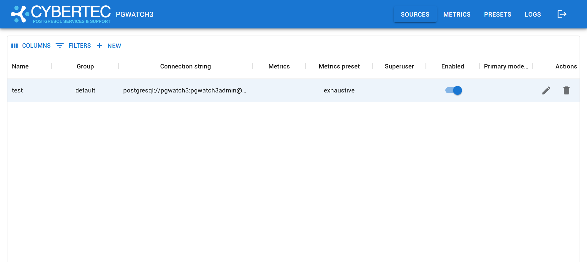

For easy configuration management (adding databases to monitoring, adding
metrics) there is a Web application bundled.

Besides managing the metrics gathering configurations, the two other
useful features for the Web UI would be the possibility to look at the
logs.

Default port: **8080**

Sample screenshot of the Web UI:

## Web UI security

By default, the Web UI is not secured - anyone can view and modify the
monitoring configuration. If some security is needed though it can be
enabled:

-   HTTPS

-   Password protection is controlled by `--web-user`, `--web-password` command-line parameters or
    `PW_WEBUSER`, `PW_WEBPASSWORD` environmental variables.

!!! Note
    It's better to use standard *LibPQ .pgpass files* so
    there's no requirement to store any passwords in pgwatch config
    database or YAML config file.

For security sensitive environments make sure to always deploy password
protection together with SSL, as it uses a standard cookie based
techniques vulnerable to snooping / MITM attacks.
