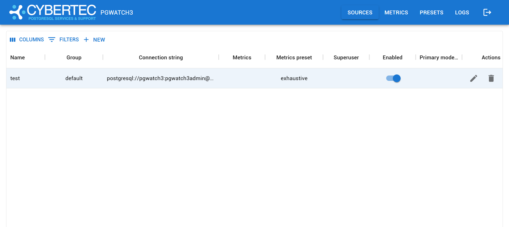

For easy configuration management (adding databases to monitoring, adding metrics) there is a Web application bundled.

Besides managing the metrics gathering configurations, the two other useful features for the Web UI are the possibility to look at the logs and to add custom metrics through the **METRICS** page.

Default port: **8080**.

Sample screenshot of the Web UI:

## Security

By default the Web UI is **not secured** — anyone who can reach the port can view and modify the monitoring configuration. Authentication, HTTPS, and the related environment variables are documented in [Reference: CLI & environment variables → WebUI](../reference/cli_env.md#webui).

For a one-shot recipe that turns authentication and TLS on across the whole Docker image, see [How-to: Harden a Docker deployment](../howto/harden_docker_deployment.md).
