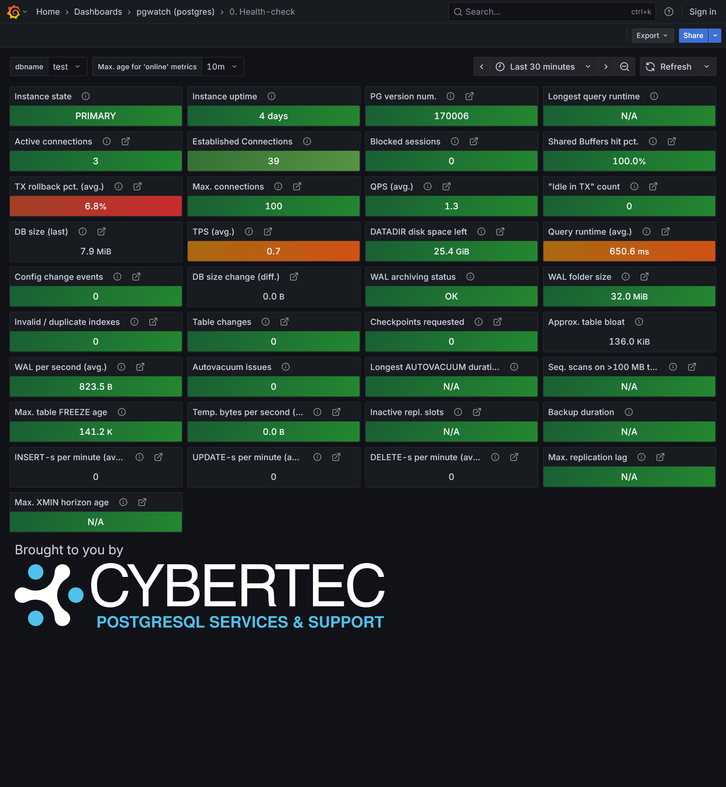
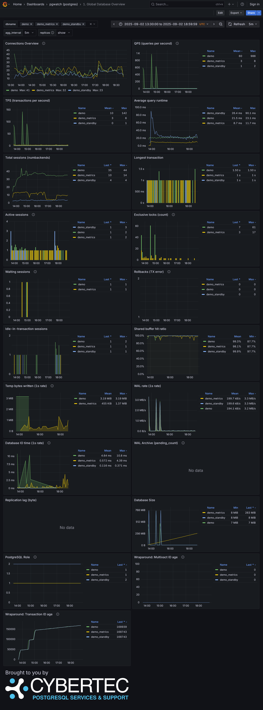
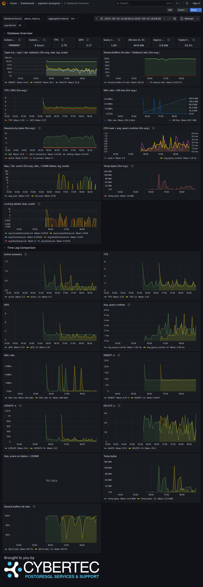
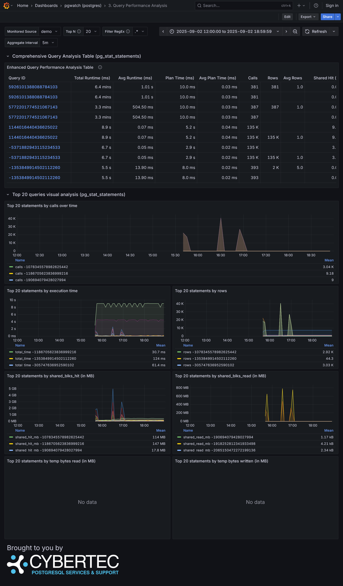
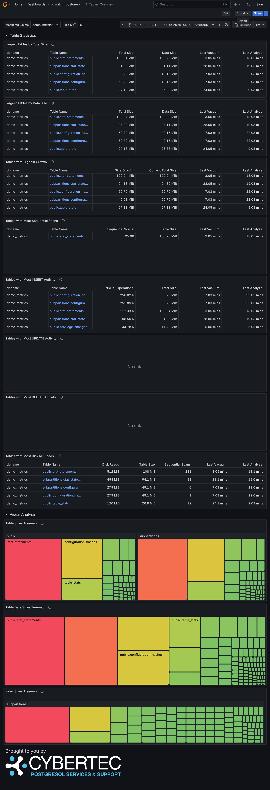
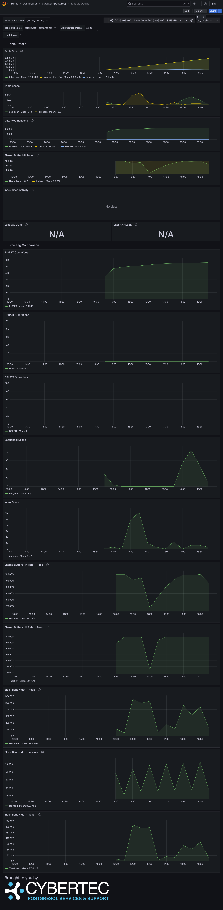

# Dashboards

Dashboards are a collection of visualizations that are displayed in a single page. They are useful for monitoring and analyzing data.

The complete list of available dashboards can be found in the official repository under 
[/grafana](https://github.com/cybertec-postgresql/pgwatch/tree/master/grafana).

## 0. Health Check

{data-gallery="dashboards"}

## 1. Global Database Overview

{data-gallery="dashboards"}

## 2. Database Overview

{data-gallery="dashboards"}

## 3. Query Performance Analysis

{data-gallery="dashboards"}

## 4. Tables Overview

{data-gallery="dashboards"}

## 5. Table Details

{data-gallery="dashboards"}

## Global Health

{data-gallery="dashboards"}

## Checkpointer, Background Writer, I/O statistics

{data-gallery="dashboards"}

## Indexes Overview

{data-gallery="dashboards"}

## Change Events

{data-gallery="dashboards"}

## PostgreSQL Versions Overview

{data-gallery="dashboards"}

## Recommendations

{data-gallery="dashboards"}

## Replication Lag

{data-gallery="dashboards"}

## Server Log Events

{data-gallery="dashboards"}

## System Statistics

{data-gallery="dashboards"}
