# Dashboards

Dashboards are a collection of visualizations that are displayed in a single page. They are useful for monitoring and analyzing data.

Health Check
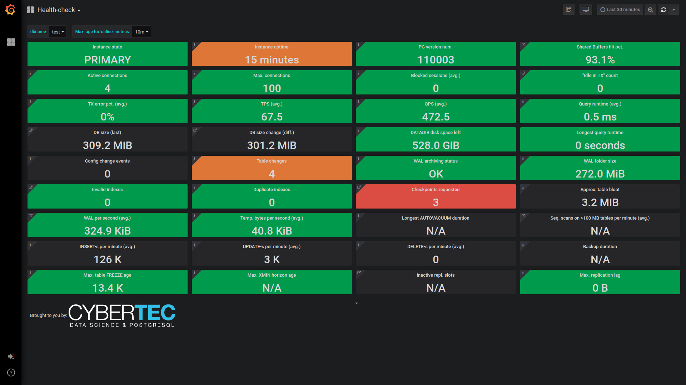{data-gallery="dashboards"}

Global Health
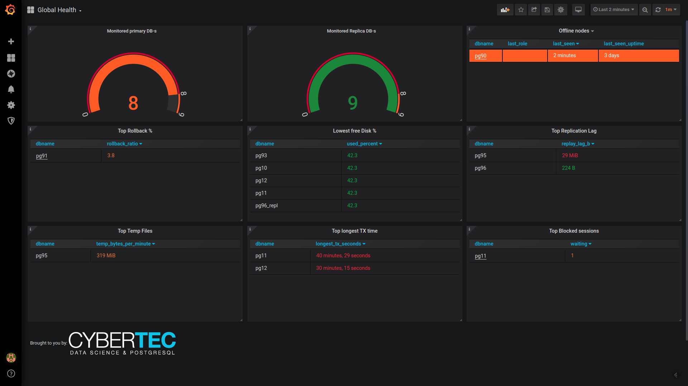{data-gallery="dashboards"}

Biggest Tables Treemap
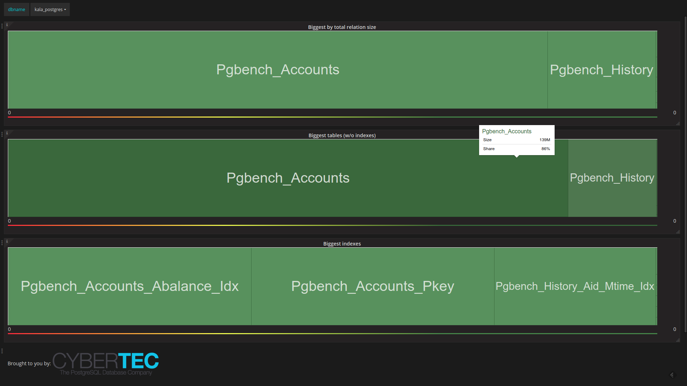{data-gallery="dashboards"}

Checkpointer, Background Writer, I/O statistics
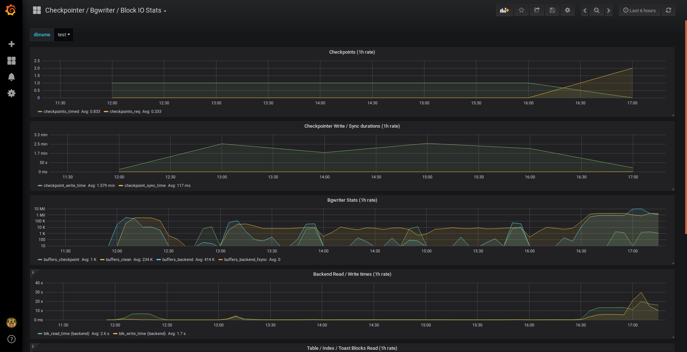{data-gallery="dashboards"}

Indexes Overview
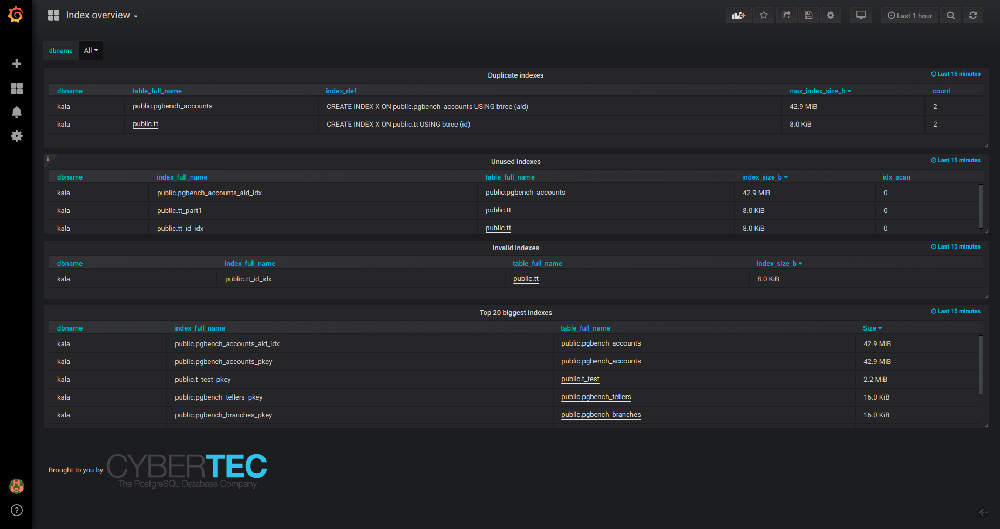{data-gallery="dashboards"}

Database Overview With Time Lag Comparison
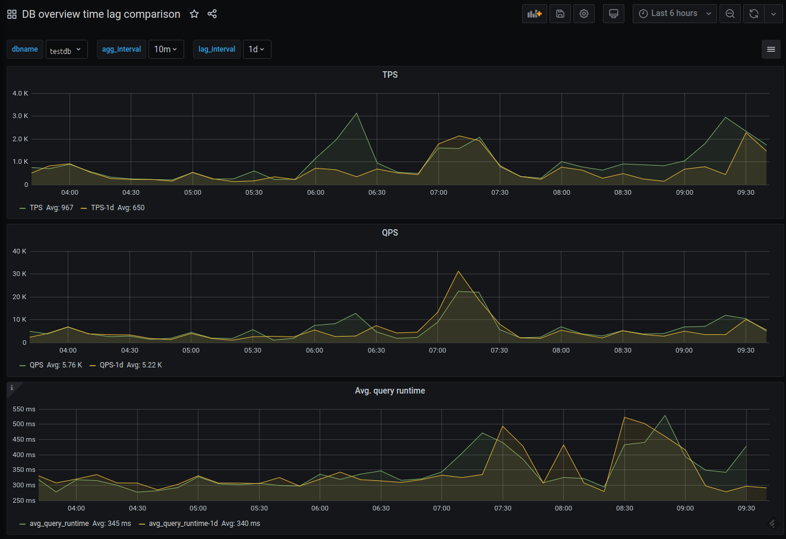{data-gallery="dashboards"}

Database Overview for Developers (Unprivileged)
{data-gallery="dashboards"}

Global Databases Overview
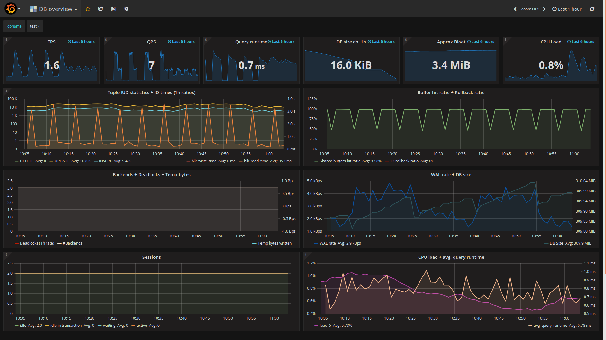{data-gallery="dashboards"}

Change Events
{data-gallery="dashboards"}

PostgreSQL Versions Overview
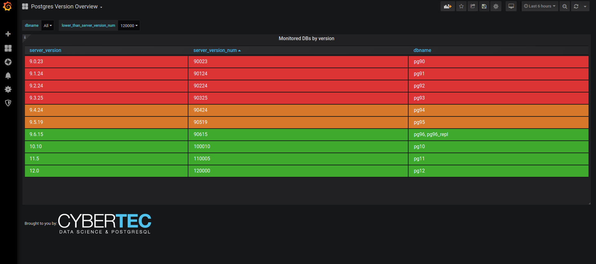{data-gallery="dashboards"}

Recommendations
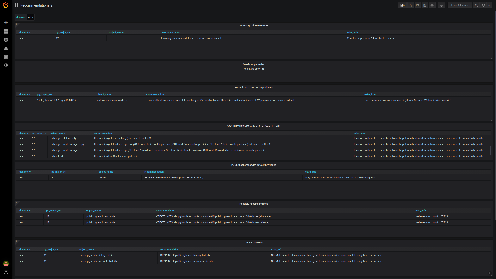{data-gallery="dashboards"}

Replication Lag
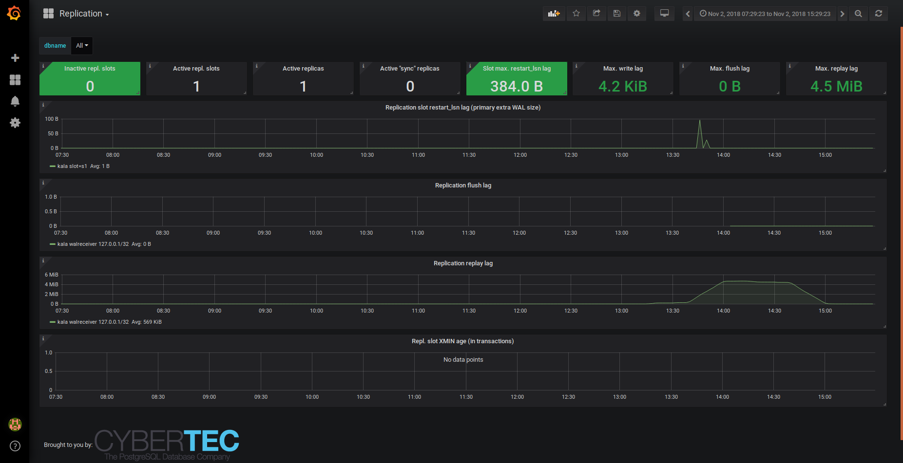{data-gallery="dashboards"}

Server Log Events
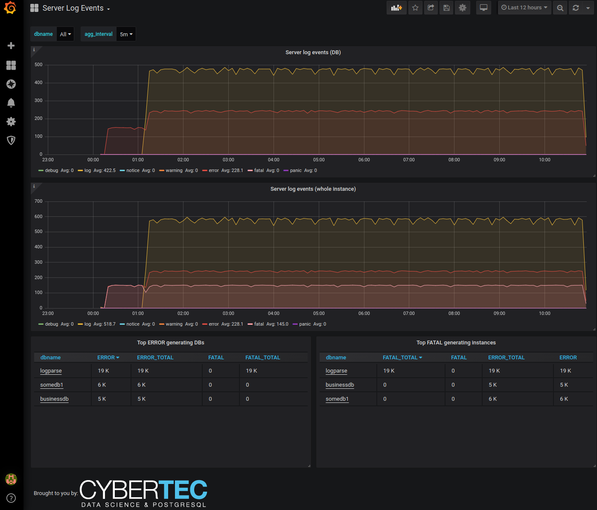{data-gallery="dashboards"}

Stat Statements SQL Search
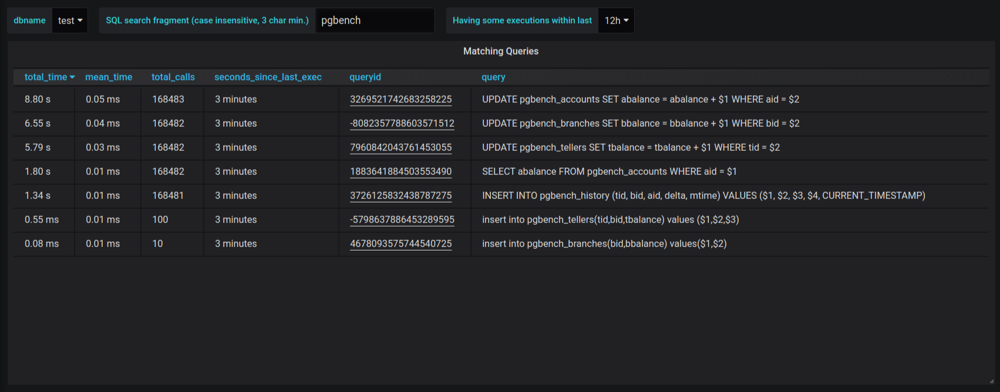{data-gallery="dashboards"}

Stat Statements Top Visual
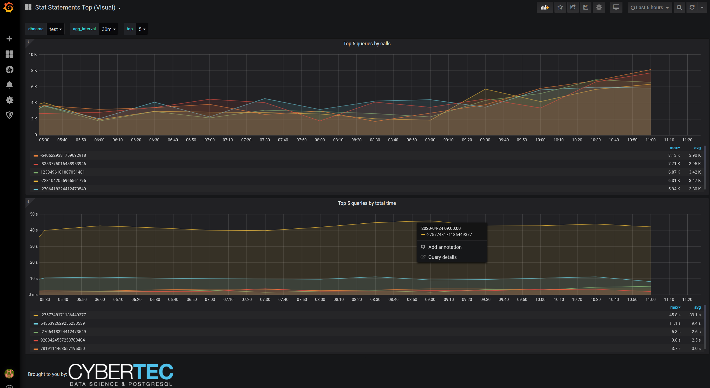{data-gallery="dashboards"}

Stat Statements Top
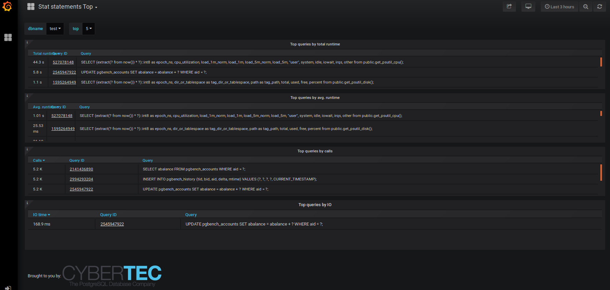{data-gallery="dashboards"}

System Statistics
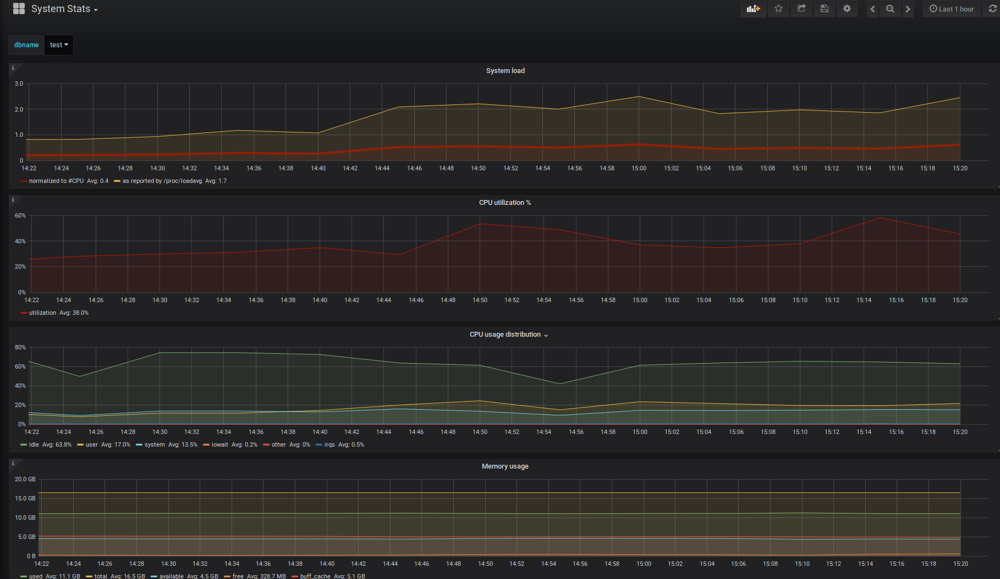{data-gallery="dashboards"}

Tables Top
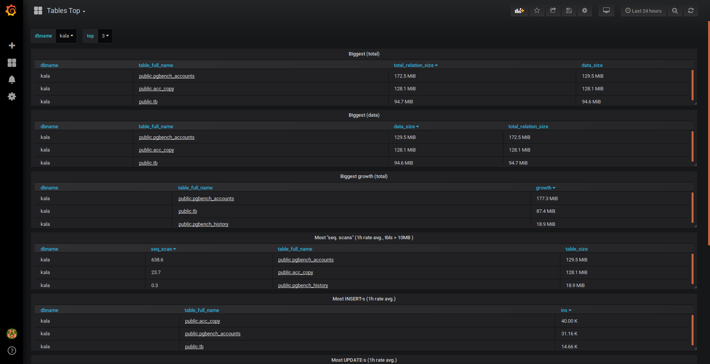{data-gallery="dashboards"}