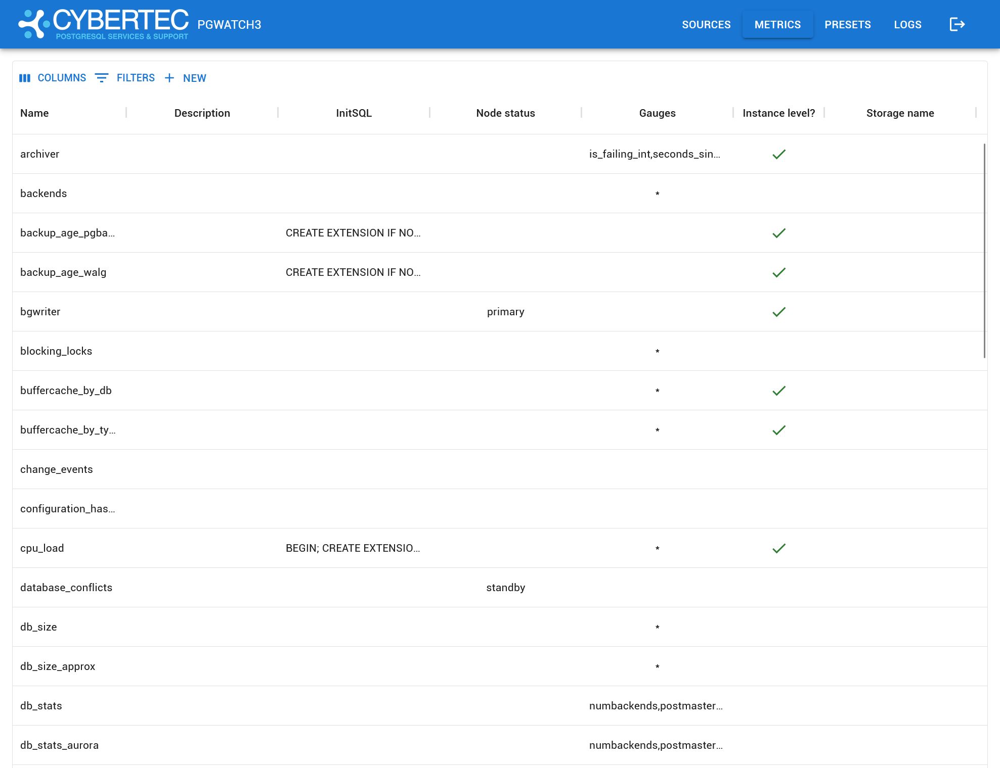
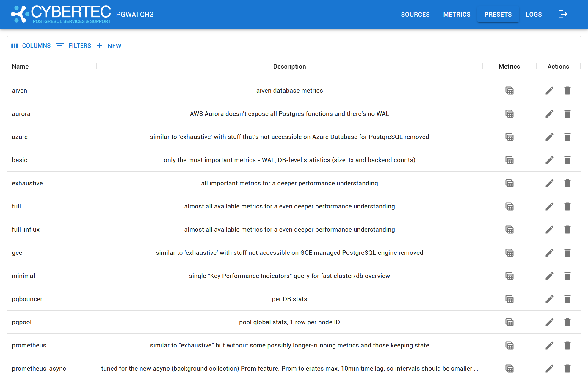
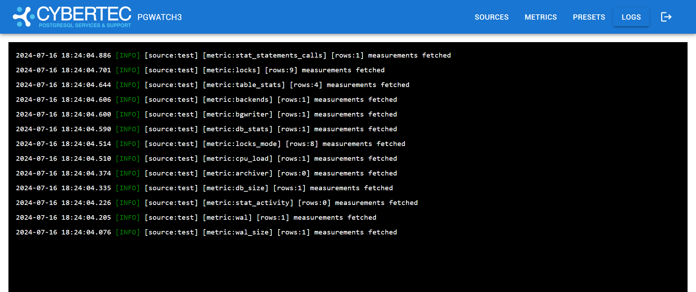

# Web User Interface

The Web User Interface (WebUI) allows you to interact with the pgwatch and control monitored sources, metrics and presets
definitions, and view and logs.

Sources
{data-gallery="webui"}

Metrics
{data-gallery="webui"}

Presets
{data-gallery="webui"}

Logs
{data-gallery="webui"}   