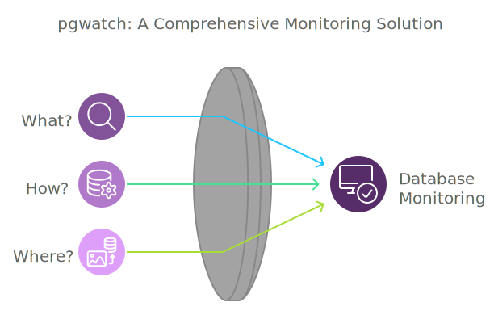

**pgwatch** is a flexible PostgreSQL-specific monitoring solution, offering a comprehensive view of database performance and health. It provides a user-friendly interface through Grafana dashboards, allowing users to easily inspect various metrics and trends.

In the world of database management, **monitoring** plays a crucial role in ensuring stability, performance, and security. With a constant need to keep databases healthy and responsive, **pgwatch** answers three fundamental questions:

## What?

**What sources to monitor?**

pgwatch is designed specifically for monitoring **PostgreSQL databases** and related infrastructure. It covers a wide range of components crucial for PostgreSQL ecosystems, including:

- **PostgreSQL Databases**: pgwatch monitors the core performance and health metrics of your PostgreSQL instances.
- **Patroni Clusters**: Monitor the health and performance of high-availability cluster members managed by **Patroni**.
- **Connection Poolers (PgPool, PgBouncer)**: pgwatch provides insights into connection pooling with both **PgPool** and **PgBouncer**.
- **Backup solutions**: Track the performance and status of **PgBackRest** and **WAL-G** backups, ensuring that your backups are executed correctly.

This extended monitoring capability allows you to gain a comprehensive view of not only your PostgreSQL databases but also the surrounding infrastructure that supports and enhances your database operations.

## How?

**What metrics are available for monitoring?**

pgwatch provides out-of-the-box support for almost all essential **PostgreSQL metrics**, including:

- Database health checks
- Query performance
- Index usage
- Disk I/O
- CPU and memory consumption
- Locks, waits, and more

In addition to the standard metrics, pgwatch can be easily extended to monitor **custom SQL-based metrics** based on your specific needs. The solution offers flexibility to fine-tune monitoring details and the aggressiveness of data collection.

## Where?

**Where are the measurements stored and where can users inspect the dashboards?**

- pgwatch allows users to choose from a variety of **storage backends** aka [**sinks**](./reference/sinks_options.md) for storing monitoring data, such as JSON file, TimescaleDB, Prometheus, PostgreSQL, or a custom gRPC-based backend.
- The **user interface** for pgwatch is powered by **Grafana dashboards**, providing interactive and detailed visualization of the collected metrics. Users can easily view the performance and status of their databases in real-time, drill down into historical data, and configure custom dashboard views based on their preferences.

For a detailed list of all features and capabilities, please refer to the [Features](intro/features.md) page.
