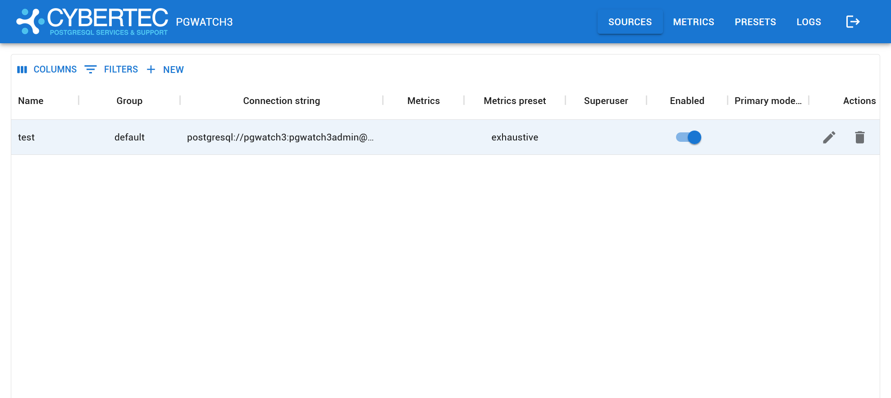

If using pgwatch in the centrally managed *Config DB* way, for easy
configuration management (adding databases to monitoring, adding
metrics) there is a small Python Web application bundled making use of
the CherryPy Web-framework.

For mass configuration changes the Web UI has some buttons to disable /
enable all hosts for example, but one could technically also log into
the configuration database and change the *pgwatch.monitored_db* table
directly.

Besides managing the metrics gathering configurations, the two other
useful features for the Web UI would be the possibility to look at the
logs of the single components and to verify that metrics gathering is
working on the "Stat Statements Overview" page, which will contact the
metrics DB (only Postgres is supported) and present some stats
summaries.

Default port: **8080**

Sample screenshot of the Web UI:

## Web UI security

By default the Web UI is not secured - anyone can view and modify the
monitoring configuration. If some security is needed though it can be
enabled:

-   HTTPS

-   Password protection is controlled by `--web-user`, `--web-password` command-line parameters or
    `PW_WEBUSER`, `PW_WEBPASSWORD` environmental variables.

-   Note that it's better to use standard *LibPQ .pgpass files* so
    there's no requirement to store any passwords in pgwatch config
    database or YAML config file.

For security sensitive environments make sure to always deploy password
protection together with SSL, as it uses a standard cookie based
techniques vulnerable to snooping / MITM attacks.

## Exposing the component logs

When using the Docker images, internal component logs (Postgres,
Grafana, Go daemon, Web UI itself) are exposed via the "/logs"
endpoint. If this is not wanted set the PW_WEBNOCOMPONENTLOGS env.
variable. Note that if a working "/logs" endpoint is desired also in
custom setup mode (non-docker) then some actual code changes are needed
to specify where logs of all components are situated - see top of the
pgwatch.py file for that.
